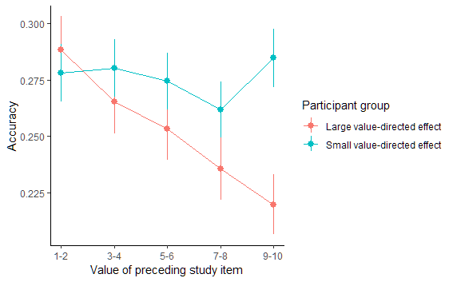
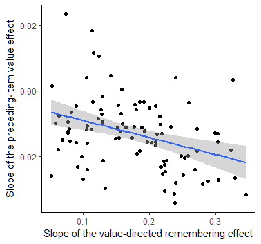

Contains preliminary data and analysis scripts I performed in 2019, looking at possible sequential effects of value-driven learning.

The data comes from https://journals.sagepub.com/doi/10.1177/0956797617702502 and was shared with me by Alan Castel on August 9, 2019. As far as I can tell the xlsx files are intact from what I received.

Middlebrooks, C. D., Kerr, T., & Castel, A. D. (2017). Selectively Distracted: Divided Attention and Memory for Important Information. Psychological Science, 28(8), 1103-1115. https://doi.org/10.1177/0956797617702502

The analysis scripts for exp1 and exp2 are the same, and the combined analysis performs the same steps, but over the joint data.

## Preliminary report

*(the following is just for my records and is based on an email I sent to Alan on August 9, 2019. It reflects results from the re-analysis of Exp2, and the figures can be reproduced from that script)*

Alan, I've done some prelim analyses and I'm happy to say that your paradigm shows the same sequential study effects (or as you called them, neighbor effects), as our directed-forgetting paradigm, and that indeed the effect is parametric. For now, I've looked at recall accuracy for item X, depending on the value of the item in study position X-1. My initial analysis did not reveal a significant effect (p ~ 0.10), but then I realized that not all of you participants show the basic value-directed remembering effect, and that those who do not, wouldn't show neighbor effects as well. So I fit a hierarchical mixed model, estimating the slope of the regular value-directed remembering effect for each participant, and then did a median split - subjects who show a weak value effect, and those that show a strong value effect. The plot below shows that those for those participants who were good at prioritizing high-value items, memory was hurt for the items that follow the high-value items (i.e., accuracy decreases as the value of the preceding X-1 item increases). The mixed-effects model shows a reliable interaction between preceding study item value and the group factor (p < .01).

I also thought that the more one participants prioritizes high-value items, the more should subsequent items suffer. Thus, there should be a negative correlation between individual-level slopes for the value effect and the preceding item value effect. Indeed, the by-participant slopes in the mixed model for these two effects show a small-to-medium negative correlation (r(96) = -.36, p < .001). Figure below shows the slopes for every individual for the two effects:

These effects are well in-line with our recent findings in Psych Science, but also extend them to show that they are parametric as a function of value.
